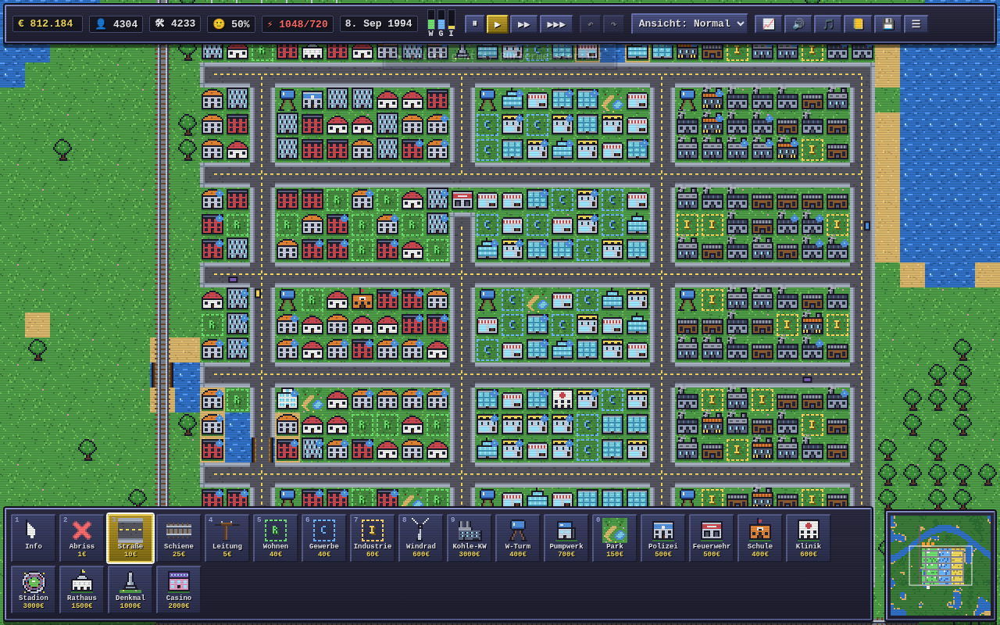
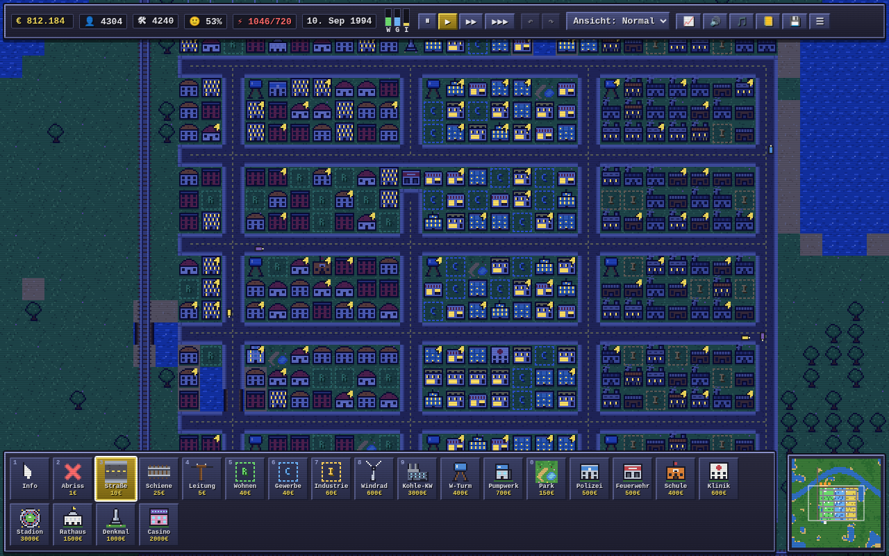
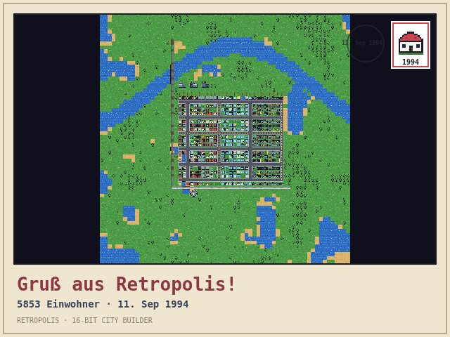

# 🏙 RETROPOLIS — 16-Bit City Builder

Ein retro-inspiriertes City-Building-Spiel im Stil der 16-Bit-Ära (SNES), komplett
im Browser spielbar und in einem Docker-Container ausgeliefert.



Alle Texturen sind **selbst entworfene Pixel-Art**, die zur Laufzeit im Code erzeugt
wird (ASCII-Pixelart + prozedurale Kacheln) — es gibt keinerlei externe Assets,
Bibliotheken oder Build-Schritte. Auch die Chiptune-Musik und alle Soundeffekte
werden live per WebAudio synthetisiert.



## 🚀 Schnellstart

```bash
docker compose up --build
```

Dann im Browser öffnen: **http://localhost:8080**

Alternativ ohne Compose:

```bash
docker build -t retropolis .
docker run -p 8080:80 retropolis
```

## 🎮 So wird gespielt

Du bist Bürgermeister:in. Baue Straßen und Kraftwerke, weise Zonen aus und
bring deine Stadt vom Dorf zur Metropole.

1. **Straßen (3)** bauen — sie erschließen Zonen und leiten Strom.
2. **Windrad (8)** oder **Kohlekraftwerk (9)** neben dem Straßennetz platzieren.
3. **Zonen ziehen**: Wohnen (5), Gewerbe (6), Industrie (7) — per Drag als Rechteck.
4. Zonen mit **Strom** und einer **Straße/Schiene im Umkreis von 3 Feldern**
   entwickeln sich über 4 Stufen — vom Häuschen zum Hochhaus.
5. **Wasser**: Ab Stufe 2 brauchen Zonen Wasserversorgung — Wasserturm bauen
   oder Pumpwerk ans Ufer setzen.
6. Mit **Polizei, Feuerwehr, Schule, Krankenhaus, Parks** Zufriedenheit und
   **Landwert** steigern — bei hohem Landwert entstehen Luxus-Hochhäuser.
7. Meilensteine schalten **Rathaus, Stadion, Denkmal und Casino** frei.

### Steuerung

| Eingabe | Aktion |
|---|---|
| Linksklick / Ziehen | Bauen (Straßen/Schienen/Leitungen als Linie, Zonen als Rechteck) |
| Rechtsklick / Ziehen | Karte verschieben |
| Mausrad / `+` `-` | Zoom (1×–4×) |
| `1`–`0` | Werkzeuge wählen |
| `Strg+Z` / `Strg+Y` | Rückgängig / Wiederholen |
| `ESC` | Info-Werkzeug (Kachel abfragen) |
| Leertaste | Pause |
| `WASD` / Pfeiltasten | Karte verschieben |
| Touch | Tippen = bauen, Ziehen = verschieben, Pinch = Zoom |

### Simulation

- **RCI-Nachfrage**: Wohnen, Gewerbe und Industrie beeinflussen sich gegenseitig
  (Jobs ⇄ Einwohner), angezeigt als Balken in der Statusleiste.
- **Stromnetz**: Kraftwerke speisen ein Netz aus Straßen, Schienen, Leitungen und
  Gebäuden. Zu wenig Erzeugung ⇒ Brownouts.
- **Wassernetz**: Wasserturm (Radius 7) und Pumpwerk am Ufer (Radius 12) versorgen
  Zonen — ohne Wasser ist bei Stufe 2 Schluss.
- **Pendler-Wegfindung**: Wohnzonen pendeln über das echte Straßen-/Schienennetz
  zum nächsten Arbeitsplatz (Multi-Source-BFS). Der Pendlerfluss erzeugt den
  Verkehr auf genau den Straßen, die wirklich benutzt werden; Schienen schlucken
  Verkehr. Getrennte Netze ohne Jobs bzw. Kunden wachsen nicht — Ursache statt
  Radius-Näherung.
- **Wachstums-Diagnose**: Das Info-Werkzeug zeigt pro Zone alle Wachstumsfaktoren
  mit ✓/✗ (Strom, Anbindung, Netzverbindung, Nachfrage, Wasser, Umwelt, Stau,
  Landwert, Steuern) — nie wieder rätseln, warum nichts wächst.
- **Brücken**: Straßen, Schienen und Leitungen können Flüsse überqueren (3× Kosten).
- **🚏 ÖPNV mit Linienverwaltung**: Baue Bus-Haltestellen, Bahnhöfe und
  U-Bahn-Stationen, lege im Linien-Panel eigene Linien an (benennen, Stopps
  per Klick auf der Karte hinzufügen, löschen). Busse fahren über Straßen,
  Züge über Schienen, U-Bahnen graben Tunnel — und verbinden sogar getrennte
  Stadtteile. Pendler steigen **automatisch** um, wenn die Linie schneller ist
  (echte Umsteige-Kanten in der Wegfindung): Das nimmt Autos von der Straße,
  verkürzt Arbeitswege und bringt Fahrgeld ein — gegen Betriebskosten je Linie
  und Stopp. Busse und Züge pendeln sichtbar auf ihren Routen, das
  „Linien“-Overlay zeigt das ganze Netz wie einen Liniennetzplan.
- **Landwert**: Wasserlage, Parks und Sicherheit steigern ihn; Verschmutzung und
  Stau drücken ihn. Hoher Landwert ⇒ Luxus-Gebäudevarianten und schnelleres Wachstum.
- **Budget & Kredite**: monatliche Steuern minus Unterhalt; bei Ebbe in der Kasse
  Kredite in 5.000-€-Schritten (1,5% Zins/Monat), jederzeit tilgbar.
- **Katastrophen**: Brände, **Tornados**, **Hochwasser** am Ufer — und
  gelegentlich ein **UFO** 👽 (alles abschaltbar).
- **Berater**: Fünf Berater-Charaktere mit Pixel-Porträts melden sich bei
  Geldnot, Stromausfall, Smog, fehlender Feuerwehr oder Wassermangel.
- **Meilensteine**: Boni bei 100 / 500 / 1.500 / 2.500 / 4.000 Einwohnern
  inkl. Freischaltung der Belohnungsgebäude.

### Spielmodi

- **Freies Spiel** — klassisch, eigene Karte per Größe (48–96) und Seed mit Vorschau.
- **Sandbox** — unbegrenztes Geld, Katastrophen aus.
- **Szenarien** mit Sieg-/Niederlagen-Bedingungen:
  - *Wachstums-Sprint*: 1.000 Einwohner in 5 Jahren.
  - *Grüne Metropole*: 2.000 Einwohner + 55% Zufriedenheit ohne Kohlekraft in 10 Jahren.
  - *Die Pleite-Stadt*: Übernimm eine verschuldete Bestandsstadt und saniere sie.

### Alleinstellungsmerkmale

- **Stadt als Link teilen**: Dank RLE-Kompression passt die ganze Stadt in eine
  URL (`…#city=…`, ~6 KB). Empfänger öffnet den Link — fertig. Kein Server,
  kein Account.
- **📟 RETRO-NET BBS**: Ein 90er-Mailbox-Terminal (mit Modem-Einwahlgeräusch!)
  zum Veröffentlichen und Einwählen von Stadt-Codes, mit lokaler Rekordliste
  und der Zeitung.
- **Benannte Bürger:innen**: Jedes bewohnte Haus hat einen deterministisch
  generierten Beispiel-Haushalt — Name, Alter, Arbeitsplatz, echter Pendelweg
  aus der Wegfindung und aktuelle Laune. Autos anklicken verrät, wer da fährt.
- **📰 Retropolis Kurier**: Zeitungs-Schlagzeilen aus echten Sim-Ereignissen
  („STAU-REKORD: Herta Kowalski pendelt 19 Felder").
- **Epochen**: Die Zeit verändert das Spiel — 1994 kommt die Solaranlage,
  1998 die CO₂-Abgabe auf Kohle, ab 2000 senken E-Autos (mit grünem Lämpchen)
  die Abgase, 2002 werden Solarmodule stärker.
- **📸 Foto-Modus**: Ein Klick rendert die Stadt als „Gruß aus …!"-Postkarte
  mit Briefmarke und Poststempel — als PNG teilbar.
- **Cheat-Codes wie früher**: `geld`, `ufo`, `sturm`, `disco` und der
  Konami-Code — aber die Statistik merkt sich, dass gemogelt wurde. 😈



### Moderne Features im Retro-Gewand

- Drag-Bau mit Live-Vorschau und Kostenanzeige, **Undo/Redo** (Strg+Z/Y)
- 10 Daten-Overlays: Strom, Wasser, Verkehr, Landwert, Umwelt, Polizei,
  Feuerwehr, Bildung, Gesundheit, Freizeit — Problemzonen zusätzlich
  **schraffiert** (farbenblind-tauglich)
- **Statistik-Panel** mit Verlaufsgraphen (Einwohner, Kasse, Zufriedenheit)
- **Tag/Nacht-Zyklus** mit leuchtenden Fenstern und Auto-Scheinwerfern
- **3 Save-Slots** mit Autosave, Export/Import als JSON-Datei
  (RLE-komprimiertes Format v4, lädt auch alte Spielstände)
- **Zweisprachig**: Deutsch/Englisch, automatisch erkannt, umschaltbar
- **Touch-optimiert**: größere Ziele, Pinch-Zoom, optionale Bau-Bestätigung
- Minimap, 3 Geschwindigkeiten + Pause, Meldungs-Toasts, Einsteiger-Tipps
- Animiertes Wasser, drehende Windräder, Rauch, fahrende Autos und Züge
- CRT-Scanline-Effekt (abschaltbar), **2 Chiptune-Songs** mit ruhigeren
  Nacht-Varianten, Ambient-Sound (Wasserrauschen, Verkehr), Lautstärkeregler

## 🗂 Projektstruktur

```
├── Dockerfile            # nginx:alpine, liefert web/ aus
├── docker-compose.yml    # Port 8080 → 80
├── nginx.conf
├── package.json          # npm test / benchmark / test:e2e
├── test/
│   ├── load-sim.js       # lädt die DOM-freie Simulation in Node
│   ├── unit.test.js      # RLE, Save v4 + Migration, Determinismus,
│   │                     #   Pendler-Konnektivität, Bau-Regeln, Kredite
│   ├── soak.test.js      # 10 Spieljahre Referenzstadt (Stabilität)
│   ├── benchmark.js      # Wachstumskurven nach Balancing-Änderungen
│   └── e2e.test.js       # Browser-Test (Playwright, eigener Static-Server)
└── web/
    ├── index.html        # UI-Gerüst (Statusleiste, Werkzeugleiste, Dialoge)
    ├── style.css         # SNES-inspiriertes UI, CRT-Effekt, Touch-Ziele
    └── js/
        ├── balance.js    # ALLE Tuning-Konstanten an einem Ort
        ├── i18n.js       # Deutsch/Englisch
        ├── sprites.js    # Pixel-Art-Engine: alle Texturen als Code, Nacht-Atlas
        ├── sim.js        # DOM-freie, deterministische Simulation: Terrain,
        │                 #   Strom, Wasser, Pendler-BFS/Verkehr, Landwert,
        │                 #   Budget/Kredite, Katastrophen, Szenarien, RLE-Saves
        ├── audio.js      # WebAudio-Chiptunes, Ambient, SFX
        └── main.js       # Chunk-Renderer, Eingabe, UI, Fahrzeuge, Tag/Nacht,
                          #   Undo/Redo, Berater, Diagnose, Statistik, Slots
```

Reines Vanilla-JavaScript (ES2020), keine Laufzeit-Abhängigkeiten, kein
Build-Schritt — der Container ist ein statischer nginx mit ~130 KB Spielcode.

**Rendering**: Statisches (Terrain, Gebäude, Straßen) wird in 16×16-Kachel-Chunks
vorgebacken und nur bei Änderungen neu gezeichnet; pro Frame laufen nur Wasser,
Feuer, Fahrzeuge, Symbole und Overlays — dadurch bleiben auch 96×96-Karten und
Mobilgeräte flüssig.

**Determinismus**: Gleicher Seed + gleiche Aktionen ⇒ exakt gleicher Verlauf
(durch Unit-Test abgesichert). Fahrzeuge und Musik sind rein kosmetisch und
davon ausgenommen.

## 🧪 Entwicklung & Tests

```bash
npm start              # lokaler Server ohne Docker (http-server)
npm test               # Unit- + Soak-Tests (reines Node, keine Dependencies)
npm run benchmark      # Wachstumskurven nach Änderungen an balance.js
npm run test:e2e       # Browser-E2E (benötigt Playwright + Chromium):
                       #   PLAYWRIGHT_PATH=… CHROMIUM_PATH=… npm run test:e2e
```

Alle Balancing-Werte liegen zentral in `web/js/balance.js`. Nach Änderungen
`npm run benchmark` ausführen und die Kurven vergleichen — der Benchmark hat
z. B. aufgedeckt, dass ein zerstörtes Einzel-Kraftwerk eine Stadt früher binnen
Tagen auslöschte (Verfallsrate inzwischen entschärft).
